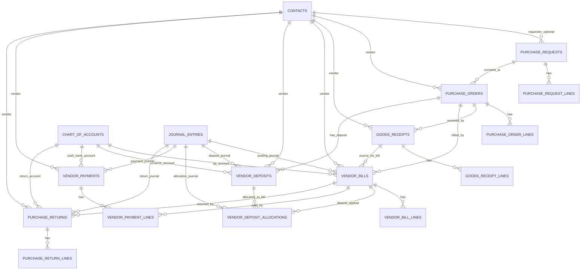
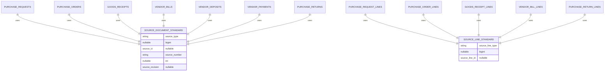
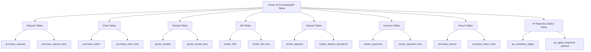

# Purchasing & Accounts Payable ERD — Mermaid Diagram

Dokumen ini berisi ERD konseptual untuk **Purchasing Workflow & Accounts Payable**.

Diagram dibuat **vertikal** dan dipecah menjadi beberapa bagian agar lebih mudah dibaca di VS Code Markdown Preview maupun GitHub.

Catatan:

- Semua tabel transaksi purchase berada di **tenant database**.
- ERD ini adalah acuan relasi konseptual Phase 10.
- Goods Receipt pada Phase 10 hanya dokumen penerimaan barang.
- Stock movement dan inventory valuation tetap masuk Phase 12.

---

## 1. ERD Overview — Purchasing/AP Vertical



---

## 2. Purchase Request ERD

```mermaid
erDiagram
    PURCHASE_REQUESTS ||--o{ PURCHASE_REQUEST_LINES : has
    PURCHASE_REQUESTS ||--o{ PURCHASE_ORDERS : converted_to

    PRODUCTS ||--o{ PURCHASE_REQUEST_LINES : requested_product
    UNITS ||--o{ PURCHASE_REQUEST_LINES : unit
    WAREHOUSES ||--o{ PURCHASE_REQUEST_LINES : target_warehouse
    DEPARTMENTS ||--o{ PURCHASE_REQUESTS : header_department
    PROJECTS ||--o{ PURCHASE_REQUESTS : header_project
    DEPARTMENTS ||--o{ PURCHASE_REQUEST_LINES : line_department
    PROJECTS ||--o{ PURCHASE_REQUEST_LINES : line_project

    PURCHASE_REQUESTS {
        bigint id PK
        string request_number UK
        date request_date
        date needed_date
        bigint requester_id nullable
        bigint department_id nullable
        bigint project_id nullable
        string status
        decimal estimated_total
        string source_type nullable
        bigint source_id nullable
        string source_number nullable
        int source_revision nullable
        int revision_no
        text notes nullable
        text internal_notes nullable
        bigint created_by nullable
        bigint submitted_by nullable
        bigint approved_by nullable
        bigint rejected_by nullable
        bigint cancelled_by nullable
        bigint converted_by nullable
        timestamp submitted_at nullable
        timestamp approved_at nullable
        timestamp rejected_at nullable
        timestamp cancelled_at nullable
        timestamp converted_at nullable
        text reject_reason nullable
        text cancel_reason nullable
        json metadata nullable
        timestamps timestamps
    }

    PURCHASE_REQUEST_LINES {
        bigint id PK
        bigint purchase_request_id FK
        bigint product_id nullable FK
        string product_code nullable
        string description
        decimal quantity
        bigint unit_id nullable FK
        decimal estimated_unit_price
        decimal estimated_line_total
        bigint warehouse_id nullable FK
        bigint department_id nullable FK
        bigint project_id nullable FK
        string source_line_type nullable
        bigint source_line_id nullable
        int sort_order
        json metadata nullable
        timestamps timestamps
    }
```

---

## 3. Purchase Order & Vendor Deposit ERD

```mermaid
erDiagram
    CONTACTS ||--o{ PURCHASE_ORDERS : vendor
    PURCHASE_REQUESTS ||--o{ PURCHASE_ORDERS : source_request
    PURCHASE_ORDERS ||--o{ PURCHASE_ORDER_LINES : has
    PURCHASE_ORDERS ||--o{ VENDOR_DEPOSITS : has_deposit

    PURCHASE_REQUEST_LINES ||--o{ PURCHASE_ORDER_LINES : source_request_line
    PRODUCTS ||--o{ PURCHASE_ORDER_LINES : product
    UNITS ||--o{ PURCHASE_ORDER_LINES : unit
    WAREHOUSES ||--o{ PURCHASE_ORDER_LINES : warehouse
    DEPARTMENTS ||--o{ PURCHASE_ORDER_LINES : department
    PROJECTS ||--o{ PURCHASE_ORDER_LINES : project
    CHART_OF_ACCOUNTS ||--o{ PURCHASE_ORDER_LINES : expense_account
    CHART_OF_ACCOUNTS ||--o{ VENDOR_DEPOSITS : cash_bank_account
    JOURNAL_ENTRIES ||--o{ VENDOR_DEPOSITS : deposit_journal

    PURCHASE_ORDERS {
        bigint id PK
        string order_number UK
        date order_date
        date expected_date nullable
        bigint vendor_id FK
        text vendor_address nullable
        text shipping_address nullable
        bigint purchase_request_id nullable FK
        string purchase_request_number nullable
        string vendor_quote_number nullable
        string contract_number nullable
        bigint buyer_id nullable
        string currency_code
        decimal exchange_rate
        boolean is_taxable
        boolean tax_included
        boolean has_down_payment
        string status
        decimal subtotal_before_discount
        decimal line_discount_total
        string header_discount_type nullable
        decimal header_discount_value nullable
        decimal header_discount_amount
        decimal subtotal_after_discount
        decimal tax_total
        decimal grand_total
        decimal received_amount
        decimal billed_amount
        string source_type nullable
        bigint source_id nullable
        string source_number nullable
        int source_revision nullable
        int revision_no
        text notes nullable
        text internal_notes nullable
        bigint created_by nullable
        bigint approved_by nullable
        bigint confirmed_by nullable
        bigint cancelled_by nullable
        bigint closed_by nullable
        timestamp approved_at nullable
        timestamp confirmed_at nullable
        timestamp cancelled_at nullable
        timestamp closed_at nullable
        text cancel_reason nullable
        json metadata nullable
        timestamps timestamps
    }

    PURCHASE_ORDER_LINES {
        bigint id PK
        bigint purchase_order_id FK
        bigint purchase_request_line_id nullable FK
        bigint product_id nullable FK
        string product_code nullable
        string description
        decimal quantity
        decimal received_quantity
        decimal billed_quantity
        decimal returned_quantity
        bigint unit_id nullable FK
        decimal unit_price
        decimal gross_amount
        string discount_type nullable
        decimal discount_value nullable
        decimal discount_amount
        bigint tax_id nullable
        decimal tax_rate nullable
        decimal tax_amount
        decimal subtotal_after_discount
        decimal line_total
        bigint warehouse_id nullable FK
        bigint department_id nullable FK
        bigint project_id nullable FK
        bigint expense_account_id nullable FK
        string source_line_type nullable
        bigint source_line_id nullable
        int sort_order
        json metadata nullable
        timestamps timestamps
    }

    VENDOR_DEPOSITS {
        bigint id PK
        string deposit_number UK
        date deposit_date
        bigint vendor_id FK
        bigint purchase_order_id nullable FK
        bigint cash_bank_account_id nullable FK
        string currency_code
        decimal exchange_rate
        decimal amount
        decimal remaining_amount
        string status
        bigint journal_entry_id nullable FK
        string source_type nullable
        bigint source_id nullable
        string source_number nullable
        int source_revision nullable
        text notes nullable
        bigint created_by nullable
        bigint posted_by nullable
        bigint voided_by nullable
        timestamp posted_at nullable
        timestamp voided_at nullable
        text void_reason nullable
        json metadata nullable
        timestamps timestamps
    }
```

---

## 4. Goods Receipt ERD

```mermaid
erDiagram
    CONTACTS ||--o{ GOODS_RECEIPTS : vendor
    PURCHASE_ORDERS ||--o{ GOODS_RECEIPTS : source_order
    GOODS_RECEIPTS ||--o{ GOODS_RECEIPT_LINES : has

    PURCHASE_ORDER_LINES ||--o{ GOODS_RECEIPT_LINES : source_order_line
    PRODUCTS ||--o{ GOODS_RECEIPT_LINES : product
    UNITS ||--o{ GOODS_RECEIPT_LINES : unit
    WAREHOUSES ||--o{ GOODS_RECEIPT_LINES : warehouse
    DEPARTMENTS ||--o{ GOODS_RECEIPT_LINES : department
    PROJECTS ||--o{ GOODS_RECEIPT_LINES : project
    CHART_OF_ACCOUNTS ||--o{ GOODS_RECEIPT_LINES : expense_account

    GOODS_RECEIPTS {
        bigint id PK
        string receipt_number UK
        date receipt_date
        bigint vendor_id FK
        bigint purchase_order_id nullable FK
        string purchase_order_number nullable
        bigint warehouse_id nullable FK
        string status
        string source_type nullable
        bigint source_id nullable
        string source_number nullable
        int source_revision nullable
        int revision_no
        text notes nullable
        text internal_notes nullable
        bigint created_by nullable
        bigint received_by nullable
        bigint cancelled_by nullable
        bigint voided_by nullable
        timestamp received_at nullable
        timestamp cancelled_at nullable
        timestamp voided_at nullable
        text cancel_reason nullable
        text void_reason nullable
        json metadata nullable
        timestamps timestamps
    }

    GOODS_RECEIPT_LINES {
        bigint id PK
        bigint goods_receipt_id FK
        bigint purchase_order_line_id nullable FK
        bigint product_id nullable FK
        string product_code nullable
        string description
        decimal quantity
        decimal billed_quantity
        decimal returned_quantity
        bigint unit_id nullable FK
        bigint warehouse_id nullable FK
        bigint department_id nullable FK
        bigint project_id nullable FK
        bigint expense_account_id nullable FK
        string source_line_type nullable
        bigint source_line_id nullable
        int sort_order
        json metadata nullable
        timestamps timestamps
    }
```

---

## 5. Vendor Bill & Deposit Allocation ERD

```mermaid
erDiagram
    CONTACTS ||--o{ VENDOR_BILLS : vendor
    PURCHASE_ORDERS ||--o{ VENDOR_BILLS : source_order
    GOODS_RECEIPTS ||--o{ VENDOR_BILLS : source_receipt
    VENDOR_BILLS ||--o{ VENDOR_BILL_LINES : has
    VENDOR_BILLS ||--o{ VENDOR_DEPOSIT_ALLOCATIONS : has_allocation
    VENDOR_DEPOSITS ||--o{ VENDOR_DEPOSIT_ALLOCATIONS : allocated

    PURCHASE_ORDER_LINES ||--o{ VENDOR_BILL_LINES : source_order_line
    GOODS_RECEIPT_LINES ||--o{ VENDOR_BILL_LINES : source_receipt_line
    PRODUCTS ||--o{ VENDOR_BILL_LINES : product
    UNITS ||--o{ VENDOR_BILL_LINES : unit
    WAREHOUSES ||--o{ VENDOR_BILL_LINES : warehouse
    DEPARTMENTS ||--o{ VENDOR_BILL_LINES : department
    PROJECTS ||--o{ VENDOR_BILL_LINES : project
    CHART_OF_ACCOUNTS ||--o{ VENDOR_BILL_LINES : expense_account
    JOURNAL_ENTRIES ||--o{ VENDOR_BILLS : posting_journal
    JOURNAL_ENTRIES ||--o{ VENDOR_DEPOSIT_ALLOCATIONS : allocation_journal

    VENDOR_BILLS {
        bigint id PK
        string bill_number UK
        date bill_date
        date due_date nullable
        bigint vendor_id FK
        string vendor_invoice_number nullable
        text vendor_address nullable
        string source_type nullable
        bigint source_id nullable
        string source_number nullable
        int source_revision nullable
        bigint purchase_order_id nullable FK
        bigint goods_receipt_id nullable FK
        bigint buyer_id nullable
        string currency_code
        decimal exchange_rate
        boolean is_taxable
        boolean tax_included
        string status
        decimal subtotal_before_discount
        decimal line_discount_total
        string header_discount_type nullable
        decimal header_discount_value nullable
        decimal header_discount_amount
        decimal subtotal_after_discount
        decimal tax_total
        decimal grand_total
        decimal applied_vendor_deposit_amount
        decimal paid_amount
        decimal returned_amount
        decimal balance_due
        bigint journal_entry_id nullable FK
        bigint deposit_allocation_journal_entry_id nullable FK
        int revision_no
        text notes nullable
        text internal_notes nullable
        bigint created_by nullable
        bigint approved_by nullable
        bigint posted_by nullable
        bigint voided_by nullable
        timestamp approved_at nullable
        timestamp posted_at nullable
        timestamp voided_at nullable
        text void_reason nullable
        json metadata nullable
        timestamps timestamps
    }

    VENDOR_BILL_LINES {
        bigint id PK
        bigint vendor_bill_id FK
        string source_line_type nullable
        bigint source_line_id nullable
        bigint purchase_order_line_id nullable FK
        bigint goods_receipt_line_id nullable FK
        bigint product_id nullable FK
        string product_code nullable
        string description
        decimal quantity
        decimal returned_quantity
        bigint unit_id nullable FK
        decimal unit_price
        decimal gross_amount
        string discount_type nullable
        decimal discount_value nullable
        decimal discount_amount
        bigint tax_id nullable
        decimal tax_rate nullable
        decimal tax_amount
        decimal subtotal_after_discount
        decimal line_total
        bigint warehouse_id nullable FK
        bigint department_id nullable FK
        bigint project_id nullable FK
        bigint expense_account_id nullable FK
        int sort_order
        json metadata nullable
        timestamps timestamps
    }

    VENDOR_DEPOSIT_ALLOCATIONS {
        bigint id PK
        bigint vendor_deposit_id FK
        bigint vendor_bill_id FK
        date allocation_date
        decimal amount
        string status
        bigint journal_entry_id nullable FK
        bigint created_by nullable
        bigint posted_by nullable
        bigint voided_by nullable
        timestamp posted_at nullable
        timestamp voided_at nullable
        text void_reason nullable
        json metadata nullable
        timestamps timestamps
    }
```

---

## 6. Vendor Payment ERD

```mermaid
erDiagram
    CONTACTS ||--o{ VENDOR_PAYMENTS : vendor
    VENDOR_PAYMENTS ||--o{ VENDOR_PAYMENT_LINES : has
    VENDOR_BILLS ||--o{ VENDOR_PAYMENT_LINES : paid_bill
    CHART_OF_ACCOUNTS ||--o{ VENDOR_PAYMENTS : cash_bank_account
    JOURNAL_ENTRIES ||--o{ VENDOR_PAYMENTS : payment_journal

    VENDOR_PAYMENTS {
        bigint id PK
        string payment_number UK
        date payment_date
        bigint vendor_id FK
        bigint cash_bank_account_id FK
        string currency_code
        decimal exchange_rate
        decimal total_amount
        string status
        bigint journal_entry_id nullable FK
        string source_type nullable
        bigint source_id nullable
        string source_number nullable
        int source_revision nullable
        text notes nullable
        bigint created_by nullable
        bigint posted_by nullable
        bigint voided_by nullable
        timestamp posted_at nullable
        timestamp voided_at nullable
        text void_reason nullable
        json metadata nullable
        timestamps timestamps
    }

    VENDOR_PAYMENT_LINES {
        bigint id PK
        bigint vendor_payment_id FK
        bigint vendor_bill_id FK
        decimal amount
        decimal discount_amount nullable
        decimal writeoff_amount nullable
        json metadata nullable
        timestamps timestamps
    }
```

---

## 7. Purchase Return ERD

```mermaid
erDiagram
    CONTACTS ||--o{ PURCHASE_RETURNS : vendor
    VENDOR_BILLS ||--o{ PURCHASE_RETURNS : source_bill
    GOODS_RECEIPTS ||--o{ PURCHASE_RETURNS : source_receipt
    PURCHASE_RETURNS ||--o{ PURCHASE_RETURN_LINES : has

    VENDOR_BILL_LINES ||--o{ PURCHASE_RETURN_LINES : source_bill_line
    GOODS_RECEIPT_LINES ||--o{ PURCHASE_RETURN_LINES : source_receipt_line
    PRODUCTS ||--o{ PURCHASE_RETURN_LINES : product
    UNITS ||--o{ PURCHASE_RETURN_LINES : unit
    WAREHOUSES ||--o{ PURCHASE_RETURN_LINES : warehouse
    DEPARTMENTS ||--o{ PURCHASE_RETURN_LINES : department
    PROJECTS ||--o{ PURCHASE_RETURN_LINES : project
    CHART_OF_ACCOUNTS ||--o{ PURCHASE_RETURNS : return_account
    JOURNAL_ENTRIES ||--o{ PURCHASE_RETURNS : return_journal

    PURCHASE_RETURNS {
        bigint id PK
        string return_number UK
        date return_date
        bigint vendor_id FK
        bigint vendor_bill_id nullable FK
        bigint goods_receipt_id nullable FK
        string source_type nullable
        bigint source_id nullable
        string source_number nullable
        int source_revision nullable
        string status
        decimal subtotal_before_discount
        decimal tax_total
        decimal grand_total
        bigint journal_entry_id nullable FK
        int revision_no
        text reason nullable
        text notes nullable
        text internal_notes nullable
        bigint created_by nullable
        bigint approved_by nullable
        bigint posted_by nullable
        bigint voided_by nullable
        timestamp approved_at nullable
        timestamp posted_at nullable
        timestamp voided_at nullable
        text void_reason nullable
        json metadata nullable
        timestamps timestamps
    }

    PURCHASE_RETURN_LINES {
        bigint id PK
        bigint purchase_return_id FK
        bigint vendor_bill_line_id nullable FK
        bigint goods_receipt_line_id nullable FK
        bigint product_id nullable FK
        string product_code nullable
        string description
        decimal quantity
        bigint unit_id nullable FK
        decimal unit_price
        decimal tax_amount
        decimal line_total
        bigint warehouse_id nullable FK
        bigint department_id nullable FK
        bigint project_id nullable FK
        string source_line_type nullable
        bigint source_line_id nullable
        int sort_order
        json metadata nullable
        timestamps timestamps
    }
```

---

## 8. AP Subsidiary Ledger & Aging ERD

```mermaid
erDiagram
    CONTACTS ||--o{ AP_SUBSIDIARY_LEDGER : vendor
    VENDOR_BILLS ||--o{ AP_SUBSIDIARY_LEDGER : bill_source
    VENDOR_PAYMENTS ||--o{ AP_SUBSIDIARY_LEDGER : payment_source
    VENDOR_DEPOSIT_ALLOCATIONS ||--o{ AP_SUBSIDIARY_LEDGER : deposit_allocation_source
    PURCHASE_RETURNS ||--o{ AP_SUBSIDIARY_LEDGER : return_source
    JOURNAL_ENTRIES ||--o{ AP_SUBSIDIARY_LEDGER : journal_source

    CONTACTS ||--o{ AP_AGING_SNAPSHOTS : vendor
    VENDOR_BILLS ||--o{ AP_AGING_SNAPSHOTS : open_bill

    AP_SUBSIDIARY_LEDGER {
        bigint id PK
        date transaction_date
        bigint vendor_id FK
        bigint vendor_bill_id nullable FK
        string source_type
        bigint source_id
        string source_number nullable
        bigint journal_entry_id nullable FK
        string movement_type
        decimal debit_amount
        decimal credit_amount
        decimal running_balance nullable
        string status
        json metadata nullable
        timestamps timestamps
    }

    AP_AGING_SNAPSHOTS {
        bigint id PK
        date aging_date
        bigint vendor_id FK
        bigint vendor_bill_id FK
        date bill_date
        date due_date nullable
        decimal original_amount
        decimal paid_amount
        decimal balance_due
        decimal current_amount
        decimal days_1_30
        decimal days_31_60
        decimal days_61_90
        decimal over_90
        json metadata nullable
        timestamps timestamps
    }
```

---

## 9. Source Chain Fields Standard



---

## 10. Phase 10 Table Grouping



---

## Notes

- `contacts` digunakan sebagai vendor master.
- `products`, `units`, `warehouses`, `departments`, dan `projects` berasal dari master data tenant.
- `chart_of_accounts` dipakai untuk account mapping dan posting journal.
- `journal_entries` adalah sumber akuntansi untuk transaksi posted.
- AP ledger dapat berupa table fisik, view, atau service-calculated result sesuai keputusan implementasi.
- AP aging dapat dihitung dinamis dari open vendor bills, atau disimpan sebagai snapshot jika dibutuhkan di fase lanjutan.
