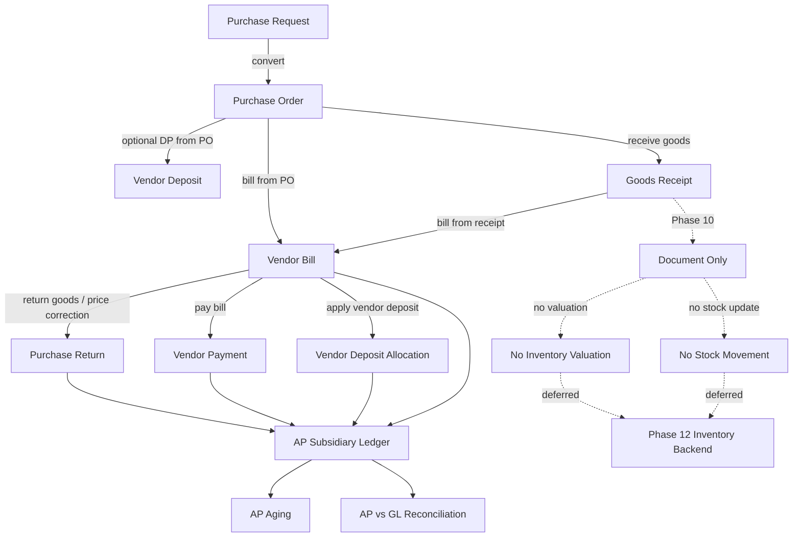
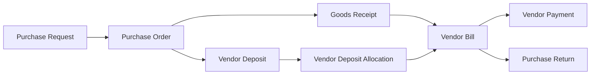
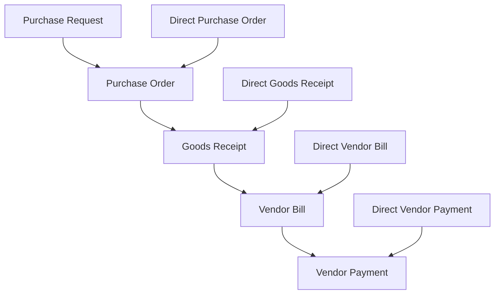
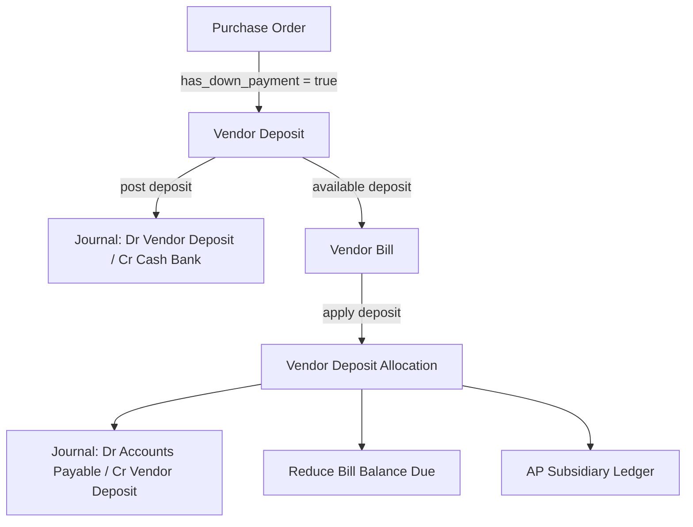
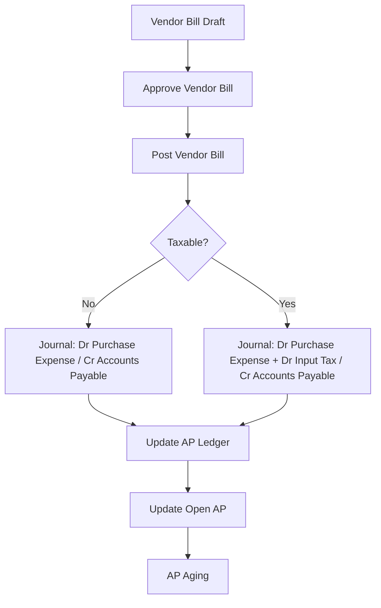
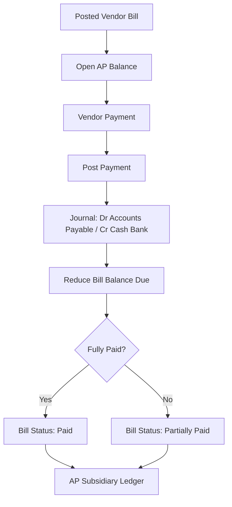
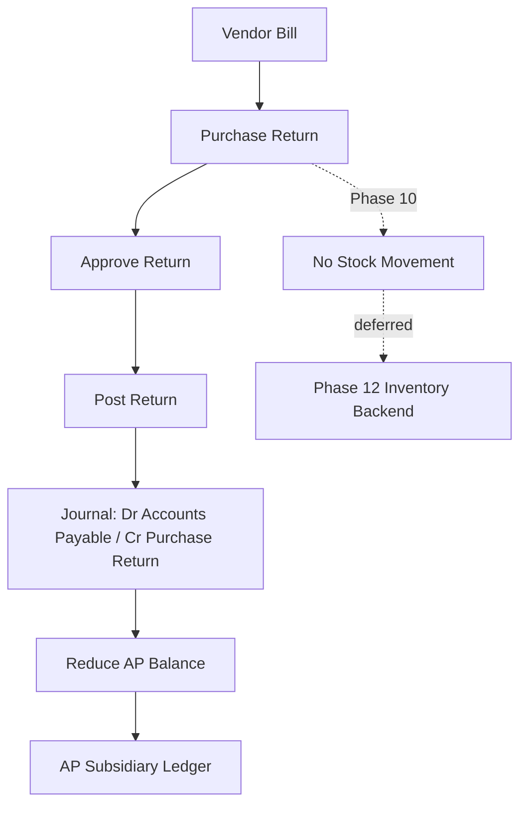
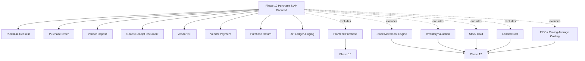
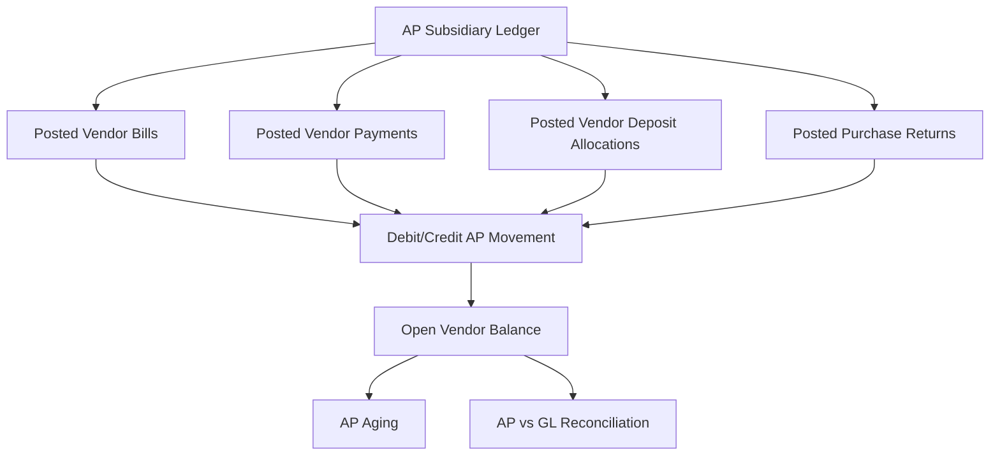

# Purchasing Workflow Mermaid Diagram

Dokumen ini berisi diagram Mermaid untuk alur **Purchasing Workflow & Accounts Payable** pada project TenantAppDevelopment.

Fokus diagram:

- Purchase Request
- Purchase Order
- Vendor Deposit
- Goods Receipt
- Vendor Bill
- Vendor Payment
- Purchase Return
- AP Subsidiary Ledger & Aging
- Batasan Phase 10 terhadap stock movement dan inventory valuation

---

## 1. Main Purchasing Workflow

---

## 2. Purchase Document Chain

---

## 3. Direct Document Creation Options

---

## 4. Vendor Deposit Flow

---

## 5. Vendor Bill Posting Flow

---

## 6. Vendor Payment Flow

---

## 7. Purchase Return Flow

---

## 8. Phase 10 Scope Boundary

---

## 9. AP Ledger Source Diagram

---

## 10. Status Summary

```mermaid
flowchart LR
    A[Purchase Request] -->|draft/submitted/approved/rejected/cancelled/converted| B[Purchase Order]
    B -->|draft/approved/confirmed/partially_received/received/partially_billed/billed/closed/cancelled| C[Goods Receipt]
    C -->|draft/received/partially_billed/billed/cancelled/void| D[Vendor Bill]
    D -->|draft/approved/posted/partially_paid/paid/overdue/void| E[Vendor Payment]
    E -->|draft/posted/void| F[AP Ledger]
```

---

## Notes

- Phase 10 adalah backend-first.
- Frontend Purchase MVP masuk Phase 15.
- Goods Receipt pada Phase 10 hanya dokumen penerimaan barang.
- Goods Receipt belum menambah stok.
- Vendor Bill belum membuat stock movement.
- Inventory valuation ditunda ke Phase 12.
- AP Subsidiary Ledger wajib reconcile dengan GL Accounts Payable.
